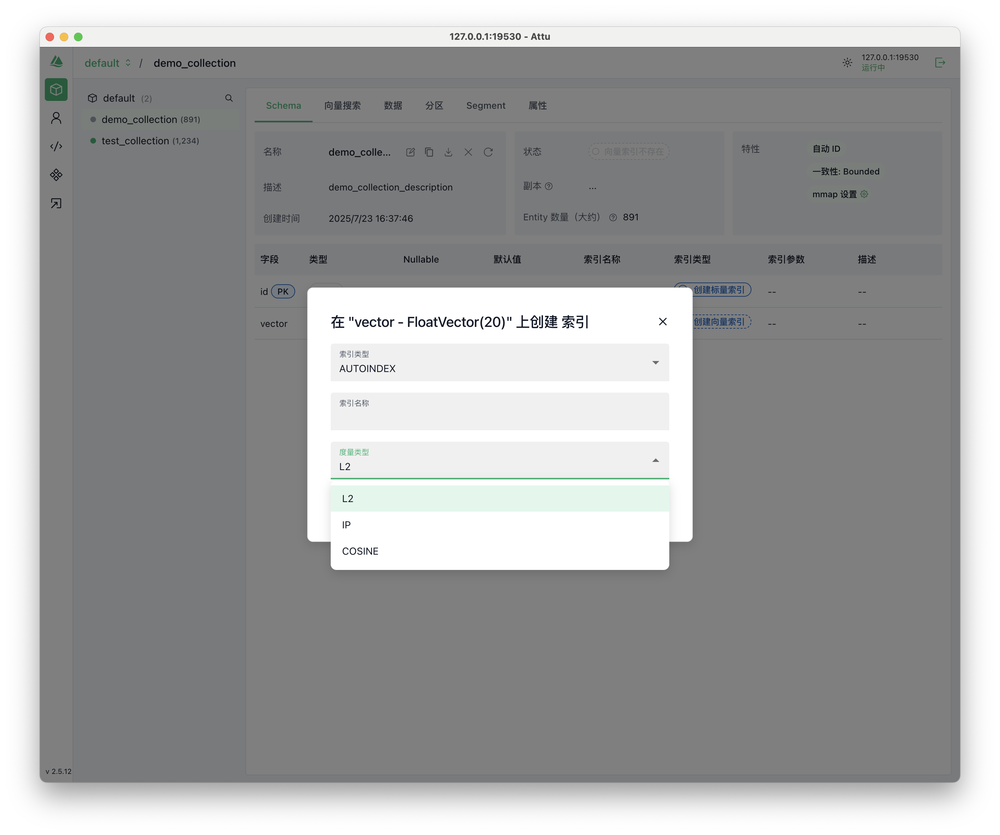
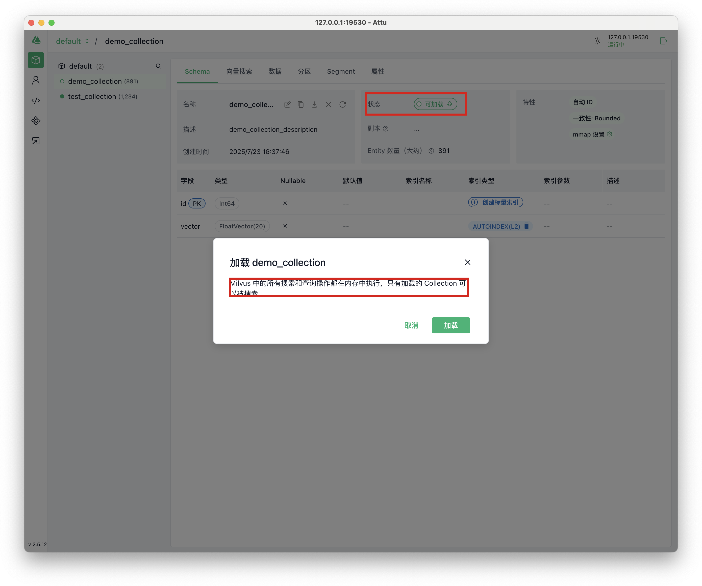
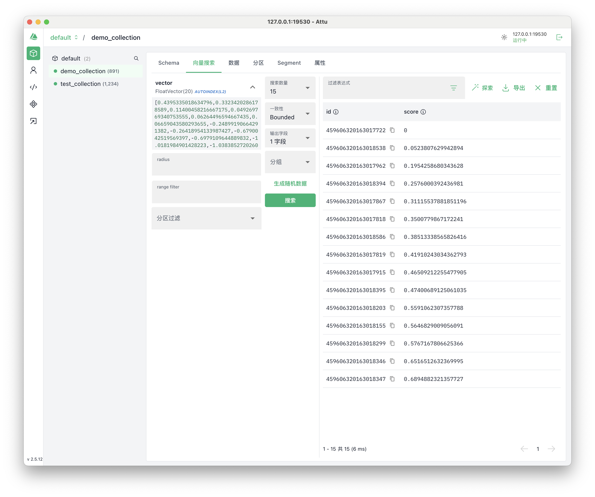

# Milvus

## 简介

Zilliz一开源的一款高性能、高扩展性**向量数据库**的名称，该数据库可在从笔记本电脑到大规模分布式系统等各种环境中高效运行。既可以作为开源软件，又可以快速够构建云服务。

### 应用场景

- 多模态数据检索

  将图片、音频、视频等非结构化数据通过Embeddings转为高纬向量。通过向量数据库进行基于相似度的查询。

- 推荐系统和个性化服务

  通过分析用户的行为历史、兴趣偏好等生成的向量，进行用户推荐。

- NLP和语义搜索

  将文本（如网页、文档、问答对）转化为向量，实现基于语义的搜索，而不是传统的关键词匹配。在RAG中应用广泛。

- **异常检测**

  在网络安全、金融风控、工业监控等场景中，**通过将行为数据模式向量化，可以快速识别出与正常模式偏差较大的异常行为或数据点。**

### 优点

- 高性能
  + 硬件感知优化：针对AVX512、SIMD、GPU 和 NVMe SSD等硬件平台进行了性能优化。**同时提供CPU和GPU版本**。
  + 高级搜索算法：Milvus 支持多种内存和磁盘索引/搜索算法，包括 IVF、HNSW、DiskANN 等，所有这些算法都经过了深度优化。
  + C++搜索引擎：由于 C++ 语言的高性能、底层优化和高效资源管理，Milvus从汇编级向量到多线程并行化和调度，以充分利用硬件能力。
  + 搜索功能丰富
    - [ANN 搜索](https://milvus.io/docs/zh/single-vector-search.md#Basic-search)：查找最接近查询向量的前 K 个向量。
    - [过滤搜索](https://milvus.io/docs/zh/single-vector-search.md#Filtered-search)：在指定的过滤条件下执行 ANN 搜索。
    - [范围搜索](https://milvus.io/docs/zh/single-vector-search.md#Range-search)：查找查询向量指定半径范围内的向量。
    - [混合搜索](https://milvus.io/docs/zh/multi-vector-search.md)：基于多个向量场进行 ANN 搜索。
    - [全文搜索](https://milvus.io/docs/zh/full-text-search.md)：基于 BM25 的全文搜索。
    - [Rerankers](https://milvus.io/docs/zh/weighted-ranker.md)：根据附加标准或辅助算法调整搜索结果顺序，完善初始 ANN 搜索结果。
    - [获取](https://milvus.io/docs/zh/get-and-scalar-query.md#Get-Entities-by-ID)：根据主键检索数据。
    - [查询](https://milvus.io/docs/zh/get-and-scalar-query.md#Use-Basic-Operators)：使用特定表达式检索数据。
- 开发者友好/多生态兼容/
  - 提供Restful API、Python、Go、Java、Node.js等多种SDK。
  - **可以使用 Promethus 和 Grafana 作为监控服务提供商，对 Milvus Distributed 的性能进行可视化监控。**

- 高可用性和可靠性

  其云原生和分布式架构确保了系统的高可用性，关键组件的无状态设计使得服务在发生故障时能够快速恢复。

- 数据类型多样

  Schema 定义了 Collections 的数据结构。在创建一个 Collection 之前，你需要设计出它的 Schema。一个Collection可以类比MySQL的一个Tab。

  **一个 Collection Schema 有一个主键、最多四个向量字段和几个标量字段。**

  - 常规数据类型：
    - 数值类型：`Int8`,`Int16`,`Int32`,`Int64`,`Float` 和`Double`
    - 布尔类型
    - 字符串`Varchar`
    - 向量`Vector`：
      - 浮点数向量：16/32位
      - 整数向量： 8 位有符号整数
      - 二进制向量：向量场中保存着0和1的列表
      - 稀疏向量：可保存非零数字及其序列号列表

  - 特殊数据类型：
    - 数组
    - JSON

## [安装](https://milvus.io/docs/zh/install-overview.md)

### 不同安装规模概述

1. 主要有三种部署规模的安装

   - **Lite（轻量版）**

     以库的形式进行安装，向量存储在本机的`.db`文件中，适合一些边缘设备。

     这些`.db`文件也可以通过命令行移动到Standalone和Distributed版本中。

   - **Standalone（单机版）**

     以docker镜像形式进行安装，适合小规模部署，进行快速原型开发。

   - **Distributed（分布式）**

      可部署在[Kubernetes](https://milvus.io/docs/install_cluster-milvusoperator.md)集群上，采取云原生架构，摄取负载和搜索查询分别由独立节点处理，允许关键组件冗余。它具有最高的可扩展性和可用性，并能灵活定制每个组件中分配的资源。适合搭建大规模向量搜索系统。

2. 三种安装方式对比

   |         功能         | Milvus Lite                                                  | Milvus 单机版                                                | 分布式 Milvus                                                |
   | :------------------: | :----------------------------------------------------------- | :----------------------------------------------------------- | ------------------------------------------------------------ |
   | **SDK / 客户端软件** | Python<br>gRPC                                               | Python<br>Go<br>Java<br>Node.js<br>C#<br>RESTful             | Python<br>Go<br>Java<br>Node.js<br>C#<br>RESTful             |
   |     **数据类型**     | 密集向量<br>稀疏向量<br>二进制向量<br>布尔值<br>整数<br>浮点<br>VarChar<br>数组<br>JSON | 密集向量<br>稀疏向量<br>二进制向量<br>布尔值<br>整数<br>浮点型<br>VarChar<br>数组<br>JSON | 密集向量<br>稀疏向量<br>二进制向量<br>布尔值<br>整数<br>浮点型<br>VarChar<br>数组<br>JSON |
   |     **搜索功能**     | 向量搜索 (ANN 搜索)<br>元数据过滤<br>范围搜索<br>标签查询<br>通过主键获取实体<br>混合搜索 | 向量搜索 (ANN 搜索)<br>元数据过滤<br>范围搜索<br>标签查询<br>通过主键获取实体<br>混合搜索 | 向量搜索 (ANN 搜索)<br>元数据过滤<br>范围搜索<br>标签查询<br>通过主键获取实体<br>混合搜索 |
   |   **CRUD 操作符**    | ✓                                                            | ✓                                                            | ✓                                                            |
   |   **高级数据管理**   | 不适用                                                       | 访问控制<br>分区<br>分区密钥                                 | 访问控制<br>分区<br>分区密钥<br>物理资源分组                 |
   |    **一致性级别**    | 强                                                           | 强<br>有界停滞<br>会话<br>最终                               | 强<br>有界停滞<br>会话<br>最终                               |

3. 三种安装方式推荐的数据规模

   

> 虽然部署规模、下载方式不同，但是对应语言的SDK的API在以上三者的使用上完全一致。只是在创建client中有略微区别。下以python为例。
>
> - Lite
>
>   ```python
>   from pymilvus import MilvusClient
>   client = MilvusClient("./milvus_demo.db")
>   ```
>
> - Standalone/Distributed
>
>   ```python
>   from pymilvus import MilvusClient
>   client = MilvusClient(uri="http://localhost:19530", token="username:password")
>   ```

### Lite

```sh
## 下载
pip install -U pymilvus

## 创建client
from pymilvus import MilvusClient
client = MilvusClient("./milvus_demo.db")
```

### Standalone（使用Docker）

```
## Download the installation script
curl -sfL https://raw.githubusercontent.com/milvus-io/milvus/master/scripts/standalone_embed.sh -o standalone_embed.sh

## Start the Docker container
bash standalone_embed.sh start

## Stop Milvus
bash standalone_embed.sh stop

## Delete Milvus data
bash standalone_embed.sh delete
```

启动服务


> 下载镜像后，OrbStack中也可以对镜像进行管理

### Distribute

参见[官方文档](https://milvus.io/docs/zh/prerequisite-helm.md)

### 相关工具安装

#### [Auth](https://milvus.io/docs/zh/quickstart_with_attu.md)

提供GUI界面，可以查看向量数据库状态、管理元数据、执行数据查询、建立向量索引、创建向量/标量索引等

##### 安装

###### Desktop Application

1. [选择合适的release version](https://github.com/zilliztech/attu/releases)

2. 对于Mac M系列芯片，执行报错`attu.app is damaged and cannot be opened`，执行以下命令再安装

   ```sh
   sudo xattr -rd com.apple.quarantine /Applications/attu.app
   ```

##### 使用方式

在**建立向量索引**并**加载到内存**后即可进行向量查询

1. **建立向量索引**

   索引类型：主要有四种

   - AUTOINDEX
   - 内存索引
   - 磁盘索引
   - GPU索引

   度量类型：

   - L2：欧几里得距离，值越小标识越相似。
   - IP：基于向量点积的相似度度量。值越大表示越相似。
   - COSINE：基于向量家教余弦值的度量，范围[-1,1]。1表示完全相同。越大相似性越高。

   

2. **加载到内存**

   建立向量索引后，状态变为`可加载`。

   

   加载到内存中后，即可进行向量查询操作。可以设置返回字段、搜索topk、数据一致性要求等。

3. **Auth中两种基本搜索方式**

   - 基本ANN搜索：查询与已知向量最接近的topk个向量，score为距离。

   
   
   - 范围搜索：设置redius、range flitter参数。参数的含义与度量类型有关（距离上界/下界是redius/range flitter与度量类型有关）。
   
     | 度量类型   | 名称                              | 设置半径和范围过滤的要求                                     |
     | :--------- | :-------------------------------- | :----------------------------------------------------------- |
     | **L2**     | L2 距离越小, 表示相似度越高。     | 要忽略最相似的向量 , 请确保 `range_filter` <= distance < `radius` |
     | **IP**     | IP 距离越大, 表示相似度越高。     | 要忽略最相似的向量, 请确保 `radius` < distance <= `range_filter` |
     | **COSINE** | COSINE 距离越大, 表示相似度越高。 | 要忽略最相似的向量, 请确保 `radius` < distance <= `range_filter` |
   
     
   
   

## Python SDK基本使用


## 压测


