# Prometheus

## 安装

### Mac本机安装

- [选择对应平台的版本](https://prometheus.ac.cn/download/)并下载，笔者版本：`prometheus-3.5.0.darwin-arm64`

  ```sh
  ##解压并进入目录
  tar xvfz prometheus-*.tar.gz
  cd prometheus-*
  ```

- 启动Prometheus

  ```sh
  ##prometheus.yml为配置文件，主要包含三部分（全局配置、告警规则、被监控的资源）
  ./prometheus --config.file=prometheus.yml
  ```

> 启动Prometheus后，默认会占用`9090`端口，提供两个URL
>
> - `http://localhost:9090/query`
>
>   可以看作是Prome的Admin平台。提供PromQL查询、告警规则、监控状态（Monitoring status）和自身服务状态（Server status）的查看和管理
>
>   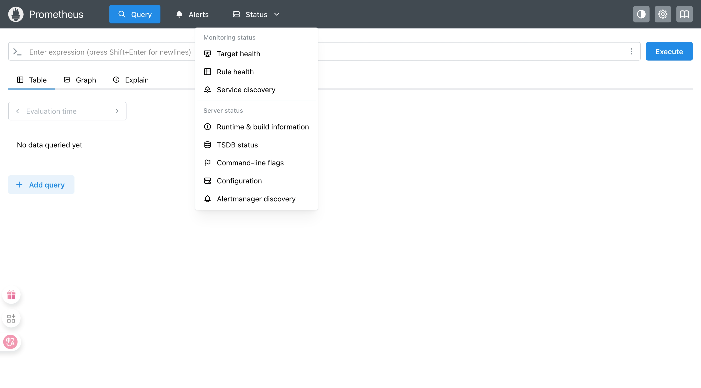
>
> - `http://localhost:9090/metrics`
>
>   Prometheus 自身也会导出一些时间序列，对自己进行监控。
>
>   - metrics上报
>
>     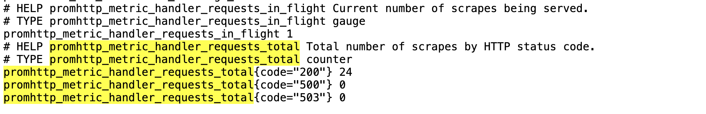
>
>   - query查询
>
>     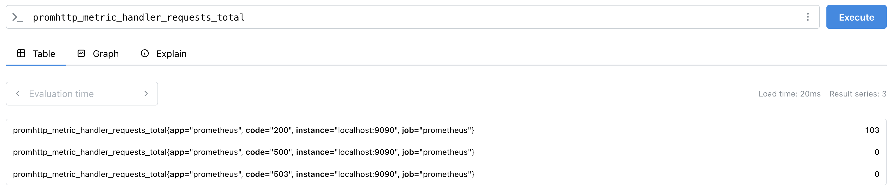

> [!NOTE] 
>
> Prometheus基本上将所有数据存为时间序列。唯一标识一个时间序列的信息由下面两部分组成：
>
> - 指标名称：
>
>   例如上文中`promhttp_metric_handler_requests_total`。
>
> - 指标标签：
>
>   一个键值对列表。例如上文中`{app="prometheus", code="200", instance="localhost:9090", job="prometheus"}`

### Docker镜像

- 下载镜像

  `docker pull prom/prometheus`默认下载tag为latest版本

  `docker pull prom/prometheus:v3.5.0`下载3.5.0版本

  > 所有版本信息查看可以在：[版本🔗](https://hub.docker.com/r/prom/prometheus/tags)

- 启动服务

  ```sh
  > docker run --name prometheus -d -p 127.0.0.1:9090:9090 prom/prometheus
  ## output:
  e442d12f1dc068ee9edd92d0a2f2996726f15f8eb48de6ba9973831666b5c955
  ```

  > **推荐使用配置文件挂载方式启动镜像**，见Note绑定配置文件挂载部分。

- 进入shell

  ```sh
  docker exec -it e442d12f1dc0 /bin/sh
  ```

  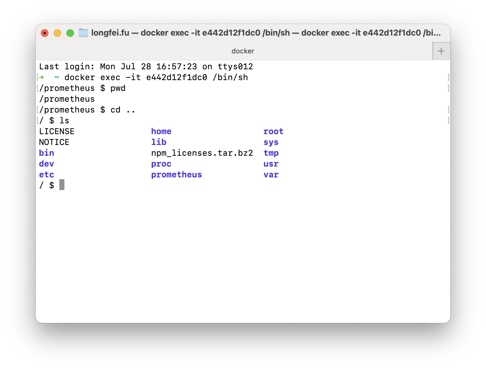

- 修改容器内`prometheus.yml`配置文件，默认路径`/etc/prometheus`，需要容器内下载文本编辑工具

  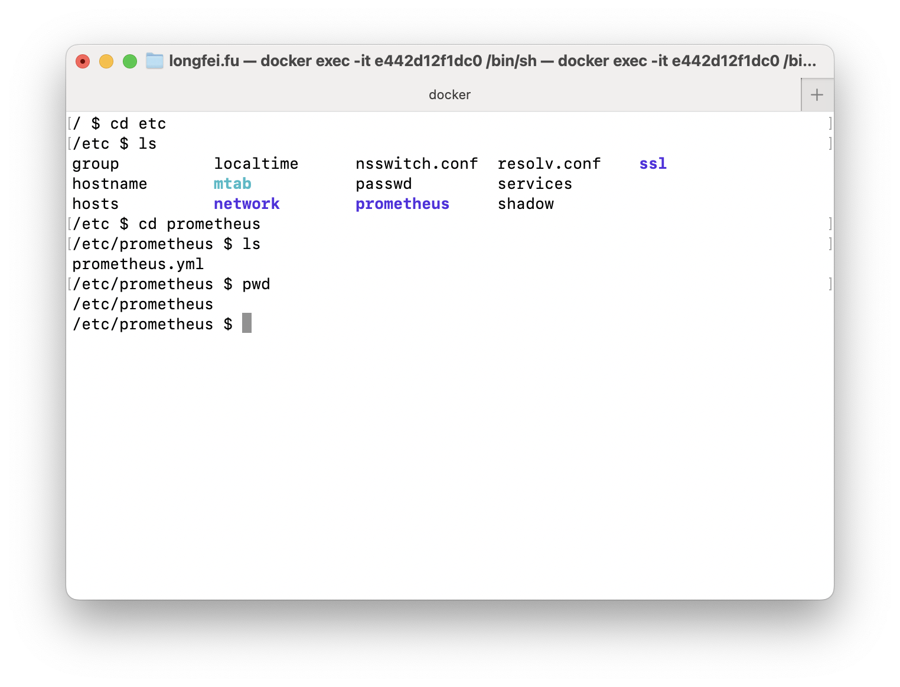

> [!NOTE]
>
> #### 绑定挂载配置文件
>
> 容器中配置文件的位置`/etc/prometheus/prometheus.yml `
>
> - 绑定挂载配置文件启动容器
>
>   本地主机创建配置文件
>
>   ```sh
>   mkdir -p ~/prometheus_config
>   cd ~/prometheus_config
>   touch prometheus.yml
>   ```
>
>   往`prometheus.yml`中写入以下信息：
>
>   ```txt
>   global:
>     scrape_interval: 15s 
>     evaluation_interval: 15s 
>
>   rule_files:
>
>   scrape_configs:
>     - job_name: "prometheus"
>       static_configs:
>         - targets: ["localhost:9090"]
>           labels:
>             app: "prometheus"
>   ```
>
>   绑定挂载配置文件启动
>
>   ```sh
>   docker run \
>   		-d \
>       -p 9090:9090 \
>       -v ~/prometheus_config/prometheus.yml:/etc/prometheus/prometheus.yml \
>       --name prometheus \
>       prom/prometheus
>   ```
>
> - 修改本地主机配置文件后重启容器
>
>   ```sh
>   ##如果正在运行先关闭
>   docker stop prometheus
>   ##再次启动
>   docker start prometheus
>   ```

## 配置

> 一个小实验：
>
> 将`prometheus.yml`中job值改为prometheustest再改成prometheustesttest，得到如下现象：
>
> ```
> ➜  prometheus_config cat prometheus.yml 
> global:
>   scrape_interval: 15s 
>   evaluation_interval: 15s 
> 
> rule_files:
> 
> scrape_configs:
>   - job_name: "prometheus"
>     static_configs:
>       - targets: ["localhost:9090"]
>         labels:
>           app: "prometheustest"
> ```
>
> - 新增6个时间序列
>
>   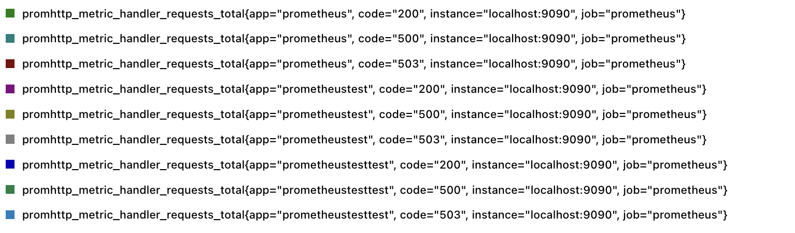
>
> - "prometheus"和"prometheustest"会先平稳一段时间（说明还在采样）再彻底没有数据。推测：修改配置后生效实际上需要一段时间，之后才停止对旧值的采样。
>
>   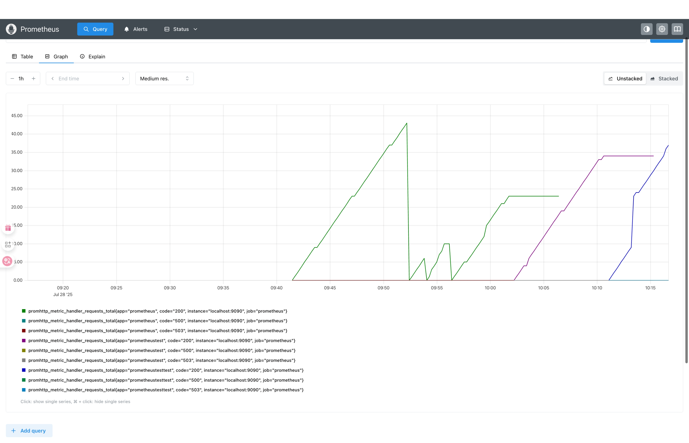

## 基本架构与原理

- Prometheus server：

  主动pull抓取并存储时间序列数据

- Alertmanager：

  处理告警的告警管理器，告警的触发、去重等

- Query && Visualization：

  查询和可视化，可以通过自带的**PromQL**以及第三方工具**Grafana**实现

  > 关于查询：也提供HTTP API支持TSDB的查询

- Time series data sources：

  - `Jobs/exporters`

    直接在数据源埋点。**数据源直接将metrics暴露在IP+端口号，等待Prometheus server来pull（前提是在Prometheus进行了配置）**

  - `Short-lived jobs`

    **对于短生命周期作业，数据源主动推送至Pushgateway，Pushgateway再由Prometheus server来pull**

  | 特性             |      直接抓取 (Direct Scraping)左下角      | 推送网关 (Pushgateway)左上角                             |
  | :--------------- | :----------------------------------------: | :------------------------------------------------------- |
  | **数据流向**     |       Prometheus Server **主动拉取**       | 作业 **主动推送** 到网关，Prometheus 再从网关拉取        |
  | **适用对象**     |      长时间运行的服务、应用、Exporter      | 生命周期非常短的批处理作业、定时任务 (CronJob)           |
  | **服务健康监控** |  通过 `up` 指标自动监控目标实例的存活状态  | 无法自动监控源作业的存活状态，只能监控 Pushgateway 本身  |
  | **指标生命周期** | 实例下线后，指标会自动标记为陈旧，易于管理 | 指标会一直保留在网关中，需要手动或额外脚本清理陈旧数据   |
  | **架构复杂度**   |                 简单，直接                 | 增加了一个中间组件，提高了架构复杂度和潜在的单点故障风险 |
  | **数据准确性**   |     更高，反映了抓取时刻的**实时状态**     | 只能反映作业**最后一次**成功推送的状态                   |


## 存储

- Prometheus 包含一个**本地磁盘时间序列数据库**，但也可选地与**远程存储系统集成**。

- Docke启动Prometheus时，数据存储在容器中`/prometheus`路径下。下文将介绍本地存储方式。

  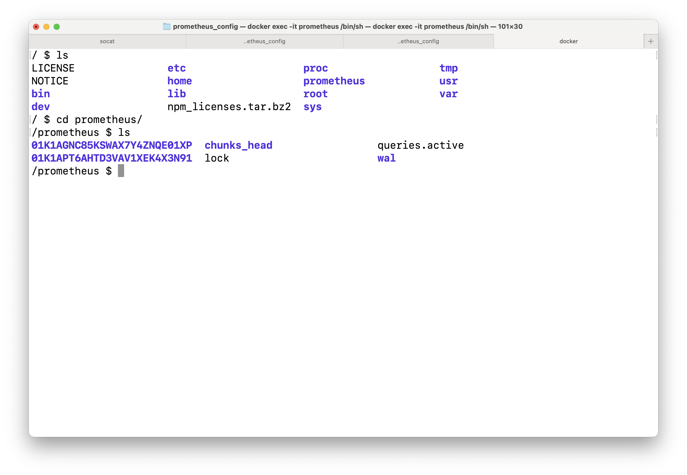

> 本地存储的局限性在于它不是集群化的，也不提供复制。因此，在驱动器或节点故障的情况下，它不能任意扩展或持久化，应像任何其他单节点数据库一样进行管理。

### 目录结构

```txt
prometheus/
├── 01K1AGNC85KSWAX7Y4ZNQE01XP
│   ├── chunks
│   │   └── 000001
│   ├── index
│   ├── meta.json
│   └── tombstones
├── 01K1APT6AHTD3VAV1XEK4X3N91
│   ├── chunks
│   │   └── 000001
│   ├── index
│   ├── meta.json
│   └── tombstones
├── chunks_head
│   ├── 000002
│   └── 000003
├── lock
├── queries.active
└── wal
    ├── 00000000
    ├── 00000001
    ├── 00000002
    └── 00000003

6 directories, 16 files
```

### 概念

#### 分块存储（Block）：

`01K1AGNC85KSWAX7Y4ZNQE01XP`就是一个块目录，每个目录代表一个时间窗口（默认为2小时）内所有被持久化的时序数据。

- `chunks`：

  存储**段文件**的目录，每个段最大`512MB`，均为压缩后数据，每个段文件中又有片。

- `index`：

  索引文件，通过唯一标识一个时间序列的**指标名称**和**指标标签**映射到chunks目录下的具体chunks

- `meta.json`：

  JSON 格式描述了这个块的核心信息。下为实际示例：

  ```json
  /prometheus/01K1AGNC85KSWAX7Y4ZNQE01XP $ cat meta.json 
  {
  	"ulid": "01K1AGNC85KSWAX7Y4ZNQE01XP",
  	"minTime": 1753762617130,## ms级单位最小块时间戳
  	"maxTime": 1753768800000,## ms级单位最大块时间戳
  	"stats": {
  		"numSamples": 142077,## 存储样本点数量
  		"numSeries": 865, ## 存储时间序列数量
  		"numChunks": 1693 ## 为了高效压缩，一条时间序列的数据会被组织成一个或多个Chunk。
  	},
  	"compaction": { ## 压缩相关信息
  		"level": 1,
  		"sources": [
  			"01K1AGNC85KSWAX7Y4ZNQE01XP"
  		]
  	},
  	"version": 1
  }/prometheus/01K1AGNC85KSWAX7Y4ZNQE01XP
  ```

- `tombstone`： 

  通过 API 删除序列时，删除记录在 `tombstone`中标识，而不是立即从数据块段中删除数据。真正的数据清理会在未来的压缩过程中完成。

> [!NOTE]
>
> 数据存储的三级结构
>
> - ###### 块Block
>
>   一个目录，它在逻辑上封装了某个固定时间范围（一般为2小时）内所有的时间序列**数据**及其**索引**。
>
>   **数据的删除和压缩都是以块为单位进行的**。旧的块可以被完整删除或合并成更大的块。
>
> - ###### 段Segment
>
>   每个段文件有大小上限（一般是512MB），写满后会创建新的段文件。段的存在主要是为了**优化IO和文件管理**。
>
>   > 如果每个“片”都存成一个小文件，会产生数百万甚至上亿个小文件，这对文件系统是灾难性的，会严重拖慢读写性能。将大量的“片”打包进一个“段”文件，可以有效减少文件数量和 I/O 开销。
>
> - ###### 片chunk
>
>   存储**单条时间序列**中一**小段连续样本（时间戳和值）**的最小物理单位。它是一段经过高效压缩的二进制数据流。


## 指标类型与基本使用

前文提及，唯一标识一个时间序列的信息由两部分组成，分别是**指标名称**与**指标标签**。

在客户端中，Prome主要提供四种核心指标类型。**在客户端client中才存在四种核心指标类型分化，在服务端server中所有数据都扁平化为无类型的时间序列。**

> [!NOTE]
>
> ### 作业和实例
>
> 1. 对于指标标签，Prometheus 抓取目标时，它会自动向抓取到的时间序列附加**作业**和**实例**的指标标签，这些标签用于标识被抓取的目标。主要是在`prometheus.yml`中配置。
>
> 2. 概念：
>
>    - 作业：具有相同目的的实例集合
>    - 实例：通常对应于单个进程
>
> 3. 一个例子：
>
>    配置文件：
>
>    ```txt
>    global:
>      scrape_interval: 15s 
>      evaluation_interval: 15s 
>    
>    rule_files:
>    
>    scrape_configs:
>      - job_name: "prometheus"
>        static_configs:
>          - targets: ["localhost:9090"]
>            labels:
>              app: "prometheus"
>      - job_name: "demo" <<<<作业
>        static_configs:
>          - targets: ["host.docker.internal:8080"]  <<<<实例列表
>            labels:
>              app: "demoapp"
>    ```
>
>    查询结果：
>
>    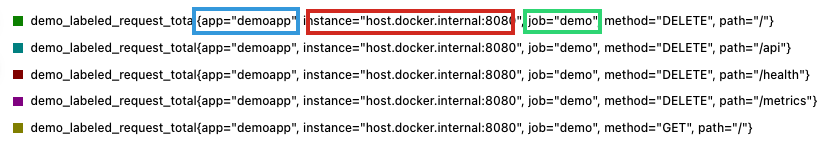
>
> 4. 基于`(job, instance)`二元组，Prometheus还会自动生成以下时间序列数据：[:link:](https://prometheus.ac.cn/docs/concepts/jobs_instances/#automatically-generated-labels-and-time-series)
>
>    - `up{job="<job-name>", instance="<instance-id>"}`目标实例是否健康，1为健康；否则为0
>    - `scrape_duration_seconds{job="<job-name>", instance="<instance-id>"}`抓取目标实例耗时

### 1.计数器Counter

- 说明：累计指标，是一个单调递增计数器，只能在重启时重制为0
- 应用场景：已处理请求数、已完成任务数、错误数

### 2.仪表盘Gauge

- 说明：可以任意增减的数据类型
- 应用场景：如温度或当前内存使用量，可“增减”的并发请求数

### 3.直方图Histogram

- 说明： 对观测值进行采样，并将其计数到可配置的桶中。
- 应用场景：平均请求延迟、QPS等

- 一个直方图类型指标在TSDB存储时包含多个时间序列：

  - `<metrics_name>_bucket{le="<upper bound>"}`

    - 统计**观测值的分布**，通过分桶来计算分位数

    - `le`意思为`less or equal`
    - 最后一个桶总是 `{le="+Inf"}`，它的值等于所有观测事件的总数，即 `<metrics_name>_count`
    - 可以在客户端代码中设置分桶区间

  - `<metrics_name>_sum`

    - 计算**观测值的总和**

  - `<metrics_name>_count`

    - 计算**观测事件发生的总次数**

  > **三者本质上都是counter**

### 4.摘要Summary

- 说明：对观测值（通常是请求持续时间或响应大小等）进行采样。计算滑动事件窗口上的分位数

- 应用场景：精确监控和告警基于百分位数（Percentile）的服务等级目标（SLO）

- 一个摘要类型指标在TSDB存储时包含多个时间序列，与直方图类似：

  + `<metrics_name>{quantile="<φ>"}`
    - 计算观测值的分位数
  + `<metrics_name>_sum`
    + **计算观测值的总和**
  + `<metrics_name>_count`
    + **计算观测事件发生的总次数**
  
  > **后两个本质上也是counter**

### Demo示意

- 修改配置文件

  ```
  global:
    scrape_interval: 15s 
    evaluation_interval: 15s 
  
  rule_files:
  
  scrape_configs:
    - job_name: "prometheus"
      static_configs:
        - targets: ["localhost:9090"]
          labels:
            app: "prometheus"
    - job_name: "demo"
      static_configs:
        - targets: ["host.docker.internal:8080"]
          labels:
            app: "demoapp"
  ```

- 启动docker

  ```sh
  docker run \
      -d \
      -p 9090:9090 \
      -v ~/prometheus_config/prometheus.yml:/etc/prometheus/prometheus.yml \
      --name prometheus \
      prom/prometheus
  ```

  > 9090是Prometheus服务的端口，8080是其获取暴露metrics的目标端口

- 运行`demometricstype.go`
	
	```go
	var (
		// 1. Counter示例：记录请求总数
		requestCounter = promauto.NewCounter(prometheus.CounterOpts{
			Name: "demo_request_total",
			Help: "Total number of requests",
		})
	
		// 2. 带标签的Counter示例
		labeledRequestCounter = promauto.NewCounterVec(prometheus.CounterOpts{
			Name: "demo_labeled_request_total",
			Help: "Total number of requests with labels",
		},
		[]string{"method", "path"},
		)
	
		// 3. Gauge示例：显示当前内存使用量
		memoryUsageGauge = promauto.NewGauge(prometheus.GaugeOpts{
			Name: "demo_memory_usage_bytes",
			Help: "Current memory usage in bytes",
		})
	
		// 4. Histogram示例：记录请求延迟分布
		requestLatencyHistogram = promauto.NewHistogram(prometheus.HistogramOpts{
			Name:    "demo_request_latency_seconds",
			Help:    "Request latency distribution in seconds",
			Buckets: []float64{0.1, 0.5, 1, 2, 5}, // 分桶区间
		})
	
		// 5. Summary示例：记录请求处理时间
		requestDurationSummary = promauto.NewSummary(prometheus.SummaryOpts{
			Name:       "demo_request_duration_seconds",
			Help:       "Request duration summary in seconds",
			Objectives: map[float64]float64{0.5: 0.05, 0.9: 0.01, 0.99: 0.001},// 分位数P50 P90 P99及其对应的误差
		})
	)
	```
	
	- Counter:`requestCounter`
	
	  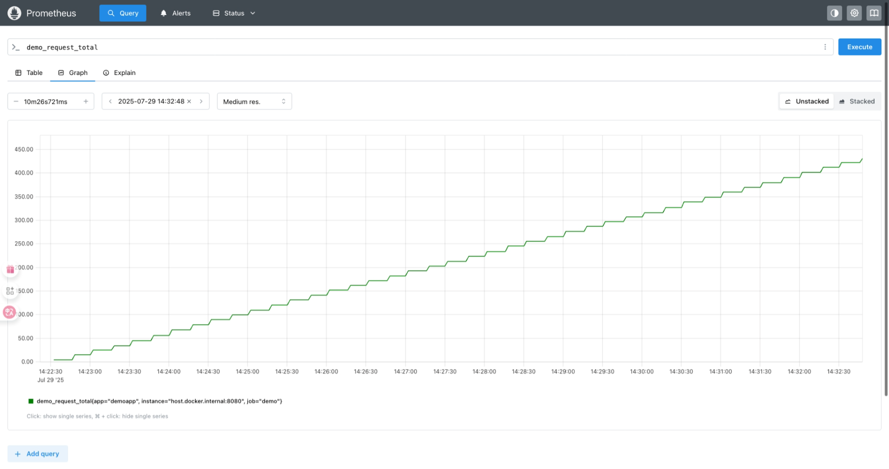
	
	- Counter with labels:`labeledRequestCounter`
	
	  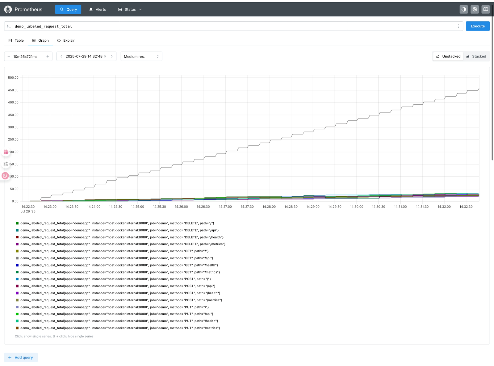
	
	- Gauge:`memoryUsageGauge`
	
	  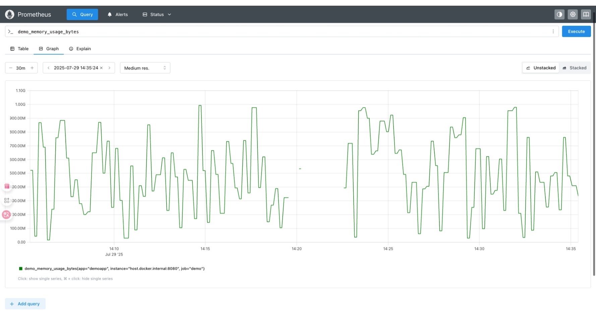
	
	- Histogram:`requestLatencyHistogram`
	
	  对应三个指标名称
	
	  + `demo_request_latency_seconds_bucket`
	
	    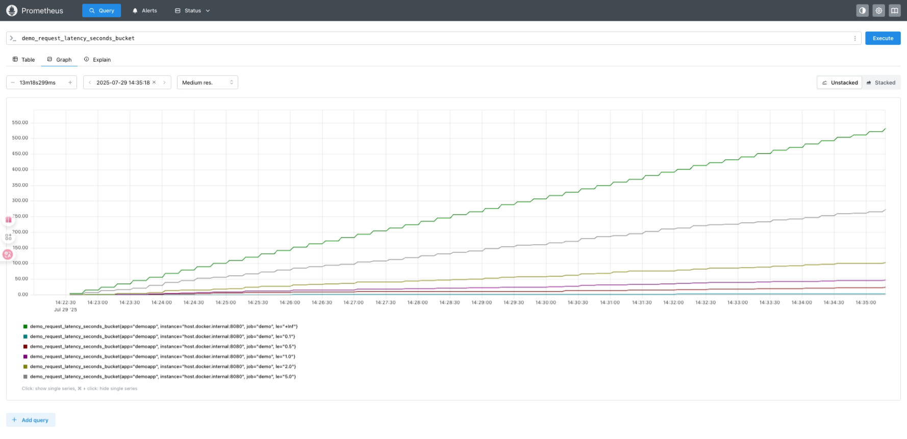
	
	  + `demo_request_latency_seconds_sum`
	
	    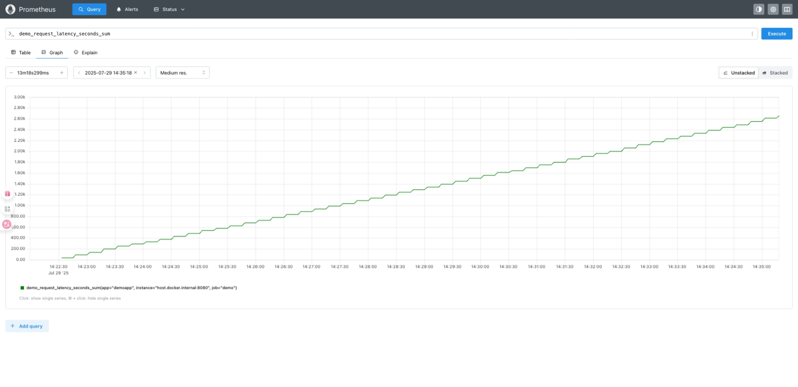
	
	  + `demo_request_latency_seconds_count`
	
	    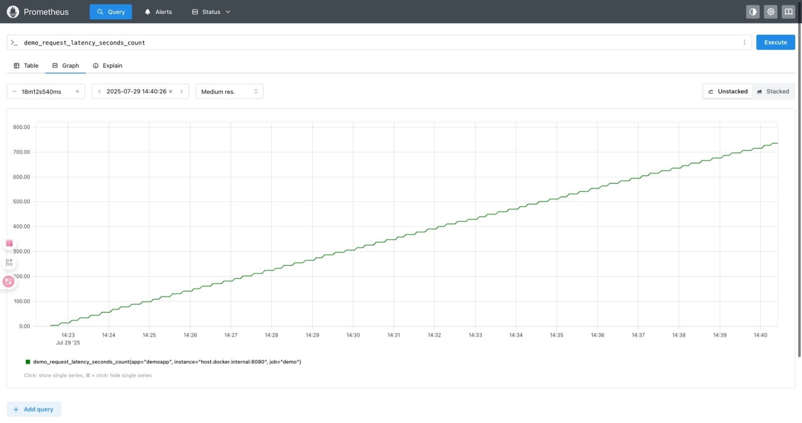
	
	- Summary:`requestDurationSummary`
	
	  对应三个指标名称
	
	  - `demo_request_duration_seconds`
	
	    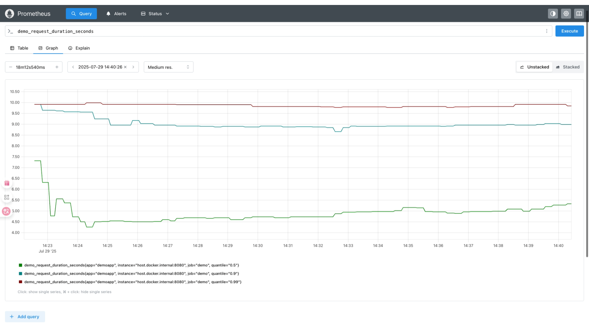
	
	  - `demo_request_duration_seconds_sum`
	
	    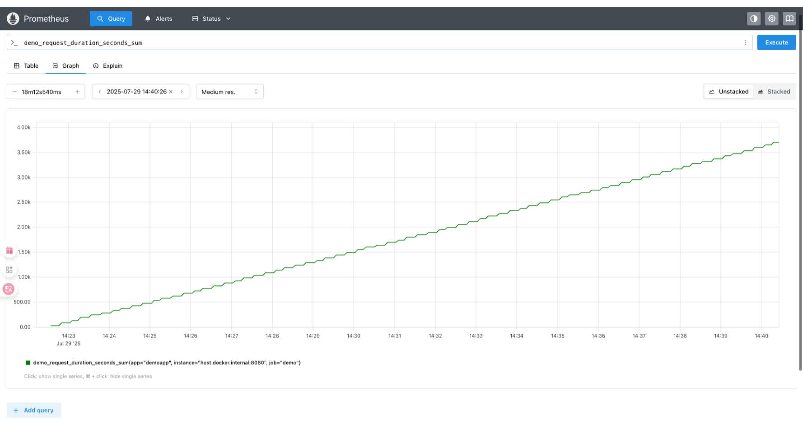
	
	  - `demo_request_duration_seconds_count`
	
	    


## draft

正如您所描述的，一个名为 `<basename>` 的直方图会生成以下三个关键的时间序列：

#### 1. **`<basename>_bucket{le="<upper inclusive bound>"}`**

- **这是直方图的核心**。`le` 标签代表 "less than or equal to"（小于或等于）。
- 它是一个**累积**计数器。也就是说，`le="200"` 的桶不仅包含了100到200毫秒之间的请求，也包含了0到100毫秒的请求。
- **作用**：通过这些分布在不同区间的桶，我们可以计算出**分位数（Quantiles）**。这是直方图最强大的功能。例如，我们可以使用 `histogram_quantile()` 函数来计算95分位数（p95），即95%的观测值都小于或等于该值。这对于评估用户体验和设定SLO至关重要。
- 最后一个桶总是 `{le="+Inf"}`，它的值等于所有观测事件的总数，即 `<basename>_count`。


#### 2. **`<basename>_sum`**


- **作用**：记录所有观测值的**总和**。
- 例如，如果我们在监控请求延迟，`_sum` 就是所有请求延迟加起来的总时间。
- 将 `_sum` 除以 `_count`，我们就可以计算出**平均值**。
  - 公式: `rate(basename_sum[5m]) / rate(basename_count[5m])` 可以计算出过去5分钟内的平均请求延迟。

#### 3. **`<basename>_count`**


- **作用**：记录观测事件发生的**总次数**。
- 例如，它代表了在特定时间段内总共收到了多少次HTTP请求。
- 这个指标本身就很有用，可以用来计算**请求速率 (QPS)**。
  - 公式: `rate(basename_count[5m])` 可以计算出过去5分钟内的平均每秒请求数。

