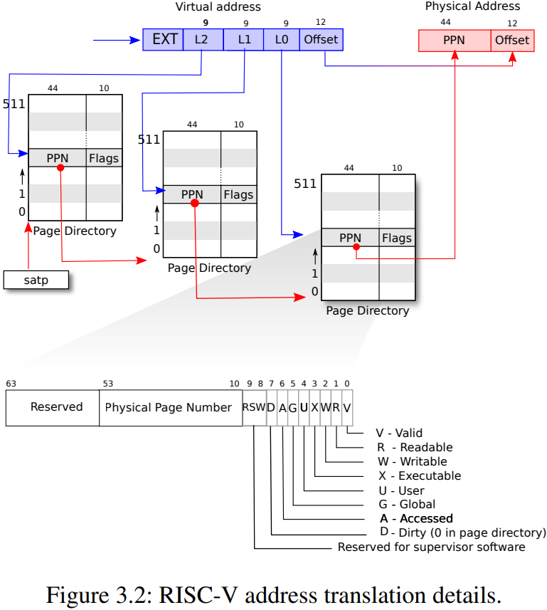
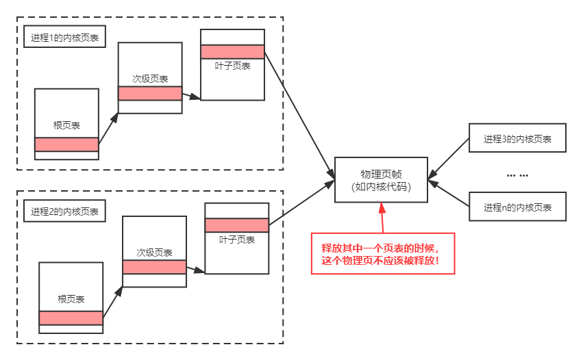
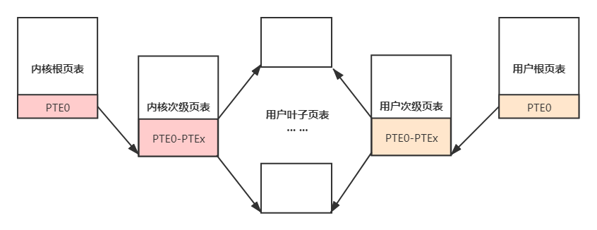

# xv6操作系统
## 关于锁
### 内存分配器
物理内存空间128MB。一个物理页帧4kb。
空闲空间会比128MB小，因为内核代码和数据会占用一部分
#### 背景
- 内存保存在单向链表freelist当中，并使用自旋锁进行保护
- 内存相关操作
  - kfree：释放内存，头插
  - kalloc：分配内存，取头
- 物理内存是在多进程之间共享的，所以不管是分配还是释放页面，都要先获得一个内存分配的锁，才能对freelist进行操作
#### 解决方案
- old：一个内存锁和存储空闲页帧的链表
- new：为8个CPU每个CPU都分配了独立的内存锁和独立的存储空闲页帧的链表。在系统初始化的时候平均分配给8个freelist
- 窃取：
  - 释放自身的锁
  - 按顺序请求别freelist的锁
    + 为空，释放锁，重复操作
    + 不为空：获取空闲页帧，释放锁

### 磁盘缓存
#### 背景
由于对磁盘的读取非常慢，而内存的速度要快得多，因此将最近经常访问的磁盘块缓存在内存里可以大大提升性能。内存中的BufferCache就担任了磁盘缓存的作用。
##### 数据结构
- bcache
  - 一个静态数组，表示bcache的内存空间。
  - 一个head指针：对bcache的操作是通过双休链表完成的LRU
  - 一个自旋锁：保护bcache结构
- buf：一个bcache里有很多个buf缓存块
  - valid：是否是从磁盘中读来的
  - disk：是否已经刷回到磁盘
  - blockno：缓存的磁盘块号
  - refcnt：被多少个进程拥有
  - data：数据区域
  - lock：保护这一个缓存块
  - next/prev：组成链表
##### 基本操作
所有的buf都被组织到一条链表中，因此如果有多个进程要使用buffer，它们并发的请求只能被顺序地处理

#### 解决方案（哈希桶）
- 获取一个buf进行读/写操作bget(int blockno)
  - 求得哈希值
  - 获取桶的锁，从前往后遍历这个桶里的buf
  - 如果命中：增加buf的引用计数、为该buf上锁，释放哈希桶的锁，返回buf
  - 如果不命中：从后往前寻找引用树为0的buf、为buf上锁，释放哈希桶的锁，修改buf中的内容。返回buf
  - 该哈希桶中没有空闲的buf，进入全局窃取阶段
    - **先释放哈希桶的锁（要不然会有死锁）**
    - **再依次获得全局锁与该哈希桶的锁(顺序反了也会有死锁)**
    - **再查看自己有没有命中（避免一个桶里blockno重复）**。如有：获得buf的锁、释放哈希桶的锁、全局锁
    - 如果没有命中：遍历除了自己的哈希桶。
      + 找到了引用数为0的：初始化这个buf，并将其添加到自己的哈希桶中，头插。获得这个buf的锁、释放这个被窃取的哈希桶、释放自己哈希桶、释放全局锁。
  
- brelse
  - 释放buf的锁
  - 获得对应的哈希桶的锁
  - 将其插入进去、并修改引用计数。如果引用计数为0的话，插入尾部
  - 释放哈希桶的锁

## 关于页表
### VPN 2 PPN

### 背景
用户程序运行和内核运行的时候，使用的是不同的页表
N（进程数） + 1个页表
- 用户态页表：每个进程都有自己的
- 内核态页表：共享内核态页表，所有进程用同一个，使用恒等映射

进程切换：用户态变、内核态不变
用户态-内核态切换：用户态不变、内核态变

处于内核态时，如果要翻译用户态的虚拟地址：因为内核页表不含对应的映射，计算机硬件MMU(内存管理单元)不能自动帮助完成这件事。因此，我们需要先找到用户程序的页表，仿照硬件翻译的流程，一步一步的找到对应的物理地址，再对其进行访问。时间开销大。

### 解决方案
- 共享内核页表->独立内核页表（N个进程，N个用户态页表，N个内核态页表）
  释放页表但不释放叶子页表指向的物理页帧（存储内核态代码和数据）
  
- 简化软件地址翻译（背景中的难点）（N个进程，N个用户态页表，N个内核态页表， 内核态页表的的部分二级页表项指向用户态的叶子页表）
  - 内核页表直接共享用户页表的叶子页表，即内核页表中次页表的部分目录项直接指向用户页表的叶子页表。
    - 内核态通过内核态页表：能访问内核/用户的代码和数据
    - 用户态用户态页表：只能访问用户态的代码和数据
  - 当我们在内核页表中拥有了用户进程的映射后，内核就可以直接访问用户进程的虚拟地址。比如可以直接解引用用户地址空间中的指针，就能获取到对应地址的数据。很多系统调用，或者内核的一些操作，都需要进行虚实地址翻译，因此我们在拥有了用户进程的地址映射后，原有麻烦的软件模拟翻译就可以被去除，很多操作都可以被简化，性能也可以得到提升。
  

